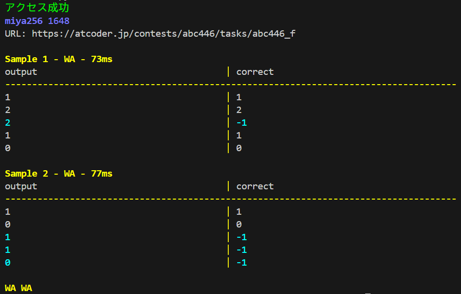
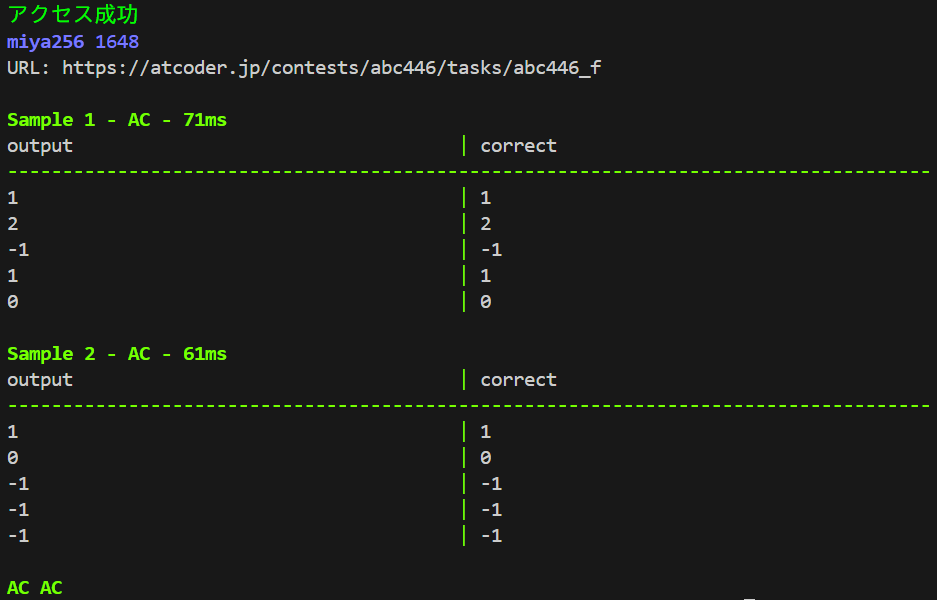

# 競技プロライブラリ

## 目的
- コンテスト中の作業を効率化するため
- 実装を忘れても問題ないようにするため

## 使い方

### セットアップ
1. uv をインストールしてください。  
    インストール方法は [公式ドキュメント](https://docs.astral.sh/uv/#installation) を参照してください。
2. リポジトリのルートで、以下を実行してください
```Bash
uv sync
```
3. `.env` を作成し、`.env.sample` を例に必要な値を設定してください。

### ライブラリ
使用したいコードを、提出コードの一番上に貼ってください。

### 1つのテストケースを試す
test/input.txtに入力をコピペしましょう。
```Bash
cat test/input.txt | uv run python test/solve.py
```

### 自動テスト（すべてのテストケースを試す）
```Bash
uv run python test/auto_test/main.py
```

※ 本ツールは主に Windows + Edge を想定しています。  
※ macOS や他のブラウザではショートカットキーが動作しない場合があります。

## プロジェクト構成

### `algorithm/`  
旧ライブラリ。libraryに移植中。

### `library/`  
新しいライブラリ。ファイルが増えてごちゃついてきたり、型ヒントやdocstringなどをちゃんとつけたくなったため。

### `test/`  
コンテスト中にコードを書くファイルなどがあります。自動テストもあります。

### `.vscode/`
スニペットファイルとそれを生成するスクリプトがあります。

## 自動テスト

### 機能

#### サンプル正誤チェック
- 開いているページの問題文や入出力例をスクレイピング
- すべての入力例で自分のコードを実行し、出力例と一致するか自動で判定

#### 提出前チェック
- 問題文に**昇順**、**辞書順**などの文字が含まれているときに知らせる
- 割った余りを求めなければならないときに知らせる
- コードに再帰関数があったとき、再帰上限を調整したか確認する

#### コード整形（提出用コードを生成）
- assert文を消す

### 実行例

#### 修正前（WA）
- 解が存在しない場合に -1 を出力していなかった。



#### 修正後（AC）



## 今後の検討

### 制約チェック
- 制約に負の数や0が含まれていた場合の警告

### 自動入力生成
- 制約・入力形式からランダム入力を生成
- 境界値ケースを自動生成し、提出前チェックに追加
